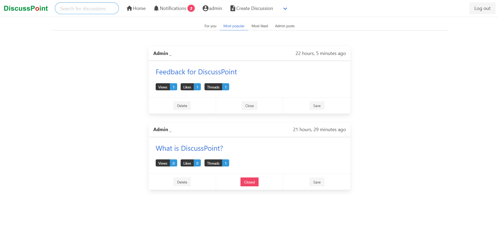
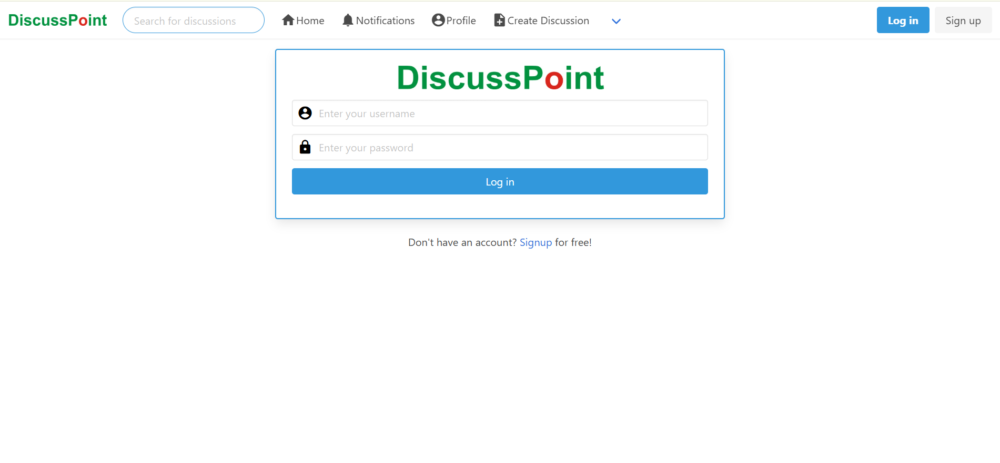
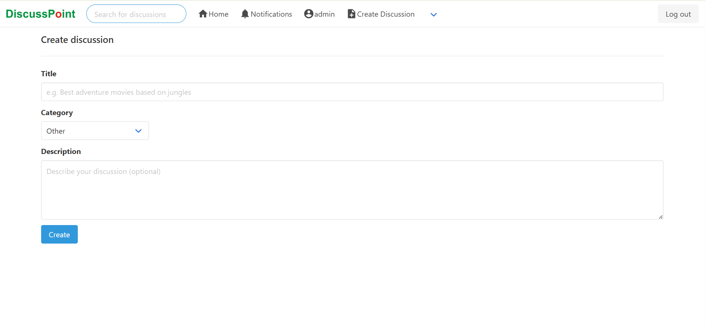
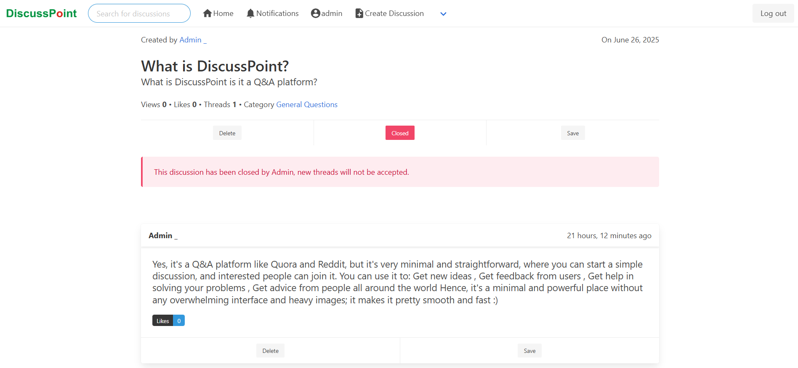
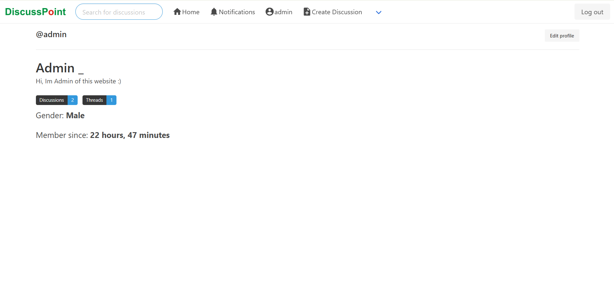
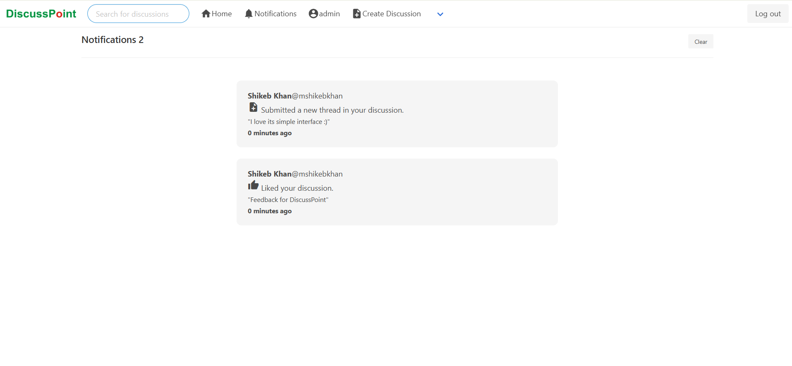

# 🗨️ Discuss Point – A Django Discussion Forum

**Discuss Point** is a lightweight, open-source forum built with Django, where users can start topic-based discussions and reply in threads.  
It's designed to be simple, responsive, and beginner-friendly — perfect for real-world learning, collaboration, and portfolio use.

---

**The Mission:**
The platform is designed to bring together curious minds and experts.
It's a space where you can ask questions, share your knowledge, and connect with others who are passionate about learning and problem-solving.

---

## 🌐 Live Website

🔗 https://discuss-point.onrender.com/

---

## 🚀 Features

❓ Ask and Answer – Easily post your questions or provide answers on a variety of topics.
📚 Topic Exploration – Follow topics of interest to see the latest questions and discussions.
💬 Community Engagement – Like, comment, and interact with users to build meaningful conversations.
👥 Follow System – Stay updated by following users and topics that resonate with you.
✨ Clean and Responsive Design – Enjoy a straightforward, user-friendly interface for an optimal experience.
📲 Mobile responsive design

---

## 📸 Screenshots

| Screenshot | Description |
|------------|-------------|
|  | Home Page / Welcome Page |
|  | Authenticated User Home Page |
|  | Login Page |
|  | Create Discussion Page |
|  | A Discussion with replies threaded below it. |
|  | User Profile Page |
|  | Notifications Page |

---

## 🛠 Tech Stack

- **Backend:** Django
- **Frontend:** HTML, CSS
- **Database:** SQLite (default), PostgreSQL (for production)
- **Hosting:** Render
- **Others:** Gunicorn, Whitenoise, dj-database-url

---

## ⚙️ Local Setup

```bash
git clone https://github.com/mshikebkhan/discuss_point.git
cd discuss-point
python -m venv venv
source venv/bin/activate  # For Windows: venv\Scripts\activate
pip install -r requirements.txt
python manage.py migrate
python manage.py createsuperuser
python manage.py runserver
```
---

## 👥 Contributing

1. Fork the repository
2. Create your feature branch: `git checkout -b feature-name`
3. Commit your changes
4. Push to your branch
5. Open a Pull Request 🚀

---

## 📌 TODO Ideas

- Customised user feed for the user based on their likes, saves, & Interests

---

## 📄 License

[MIT License](LICENSE)

---

Made with ❤️ by Shikeb Khan
